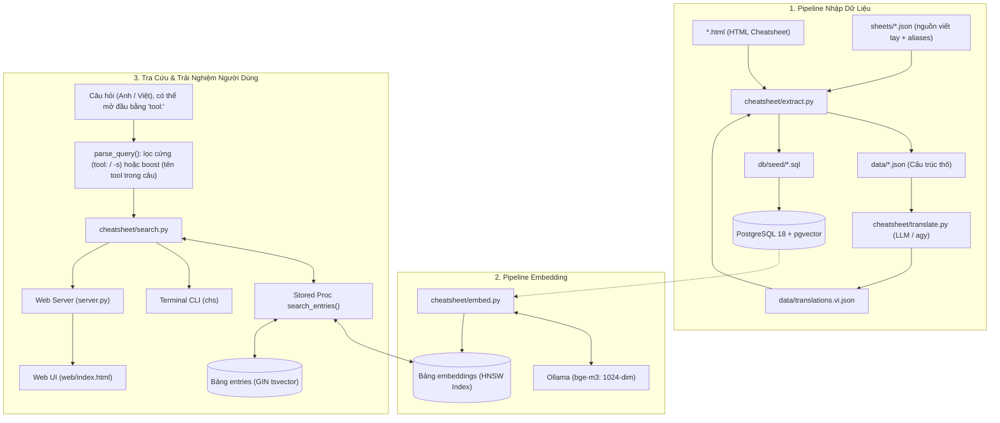

# 📚 Tài liệu Hệ thống CheatKeep (`chs`)

> **Hệ thống tra cứu cheatsheet kỹ thuật bằng ngôn ngữ tự nhiên song ngữ Anh – Việt.**  
> Kết hợp **Hybrid Search** (Semantic Vector Search qua `pgvector` + `bge-m3` và PostgreSQL Full-Text Search), hỗ trợ cả công cụ dòng lệnh **Terminal CLI (`chs`)** lẫn giao diện **Web UI**.

---

## 🗺️ Bản đồ Tính năng (Feature Index)

Tài liệu được phân chia theo từng tính năng độc lập. Sử dụng bảng dưới đây để tra cứu và truy cập nhanh:

| # | Tính năng (Feature) | Mục đích chính | Tài liệu chi tiết | File liên quan cốt lõi |
|---|---|---|---|---|
| **01** | **Hybrid Search Engine** | Tìm kiếm lai giữa Semantic Vector (`pgvector`) và Keyword (`tsvector` + `unaccent`); tiền tố `tool:` lọc cứng theo sheet, tên tool trong câu chỉ được ưu tiên (boost). | [01-hybrid-search.md](file:///home/chuminh/cheatsheet/docs/features/01-hybrid-search.md) | [`search.py`](file:///home/chuminh/cheatsheet/cheatsheet/search.py), [`schema.sql`](file:///home/chuminh/cheatsheet/db/schema.sql), [`embedder.py`](file:///home/chuminh/cheatsheet/cheatsheet/embedder.py) |
| **02** | **Data Ingestion & Extraction** | Parser đọc HTML cheatsheet hoặc nguồn viết tay `sheets/*.json` (kèm `aliases`), chuẩn hóa cây card/section, chặn alias trùng giữa các sheet, xuất seed SQL + JSON. | [02-data-extraction.md](file:///home/chuminh/cheatsheet/docs/features/02-data-extraction.md) | [`extract.py`](file:///home/chuminh/cheatsheet/cheatsheet/extract.py), [`db/seed/*.sql`](file:///home/chuminh/cheatsheet/db/seed/), `data/*.json` |
| **03** | **Bilingual Translation & Augmentation** | Dịch tự động sang tiếng Việt và sinh 3 cụm từ tìm kiếm thực tế qua LLM (`agy` / Gemini), lưu cache chống trùng lặp. | [03-translation-augmentation.md](file:///home/chuminh/cheatsheet/docs/features/03-translation-augmentation.md) | [`translate.py`](file:///home/chuminh/cheatsheet/cheatsheet/translate.py), [`translations.vi.json`](file:///home/chuminh/cheatsheet/data/translations.vi.json) |
| **04** | **Vector Embedding Pipeline** | Đánh vector embedding gia tăng (incremental) qua Ollama `bge-m3`, theo dõi `model_digest`, dọn rác vector mồ côi. | [04-embedding-pipeline.md](file:///home/chuminh/cheatsheet/docs/features/04-embedding-pipeline.md) | [`embed.py`](file:///home/chuminh/cheatsheet/cheatsheet/embed.py), [`embedder.py`](file:///home/chuminh/cheatsheet/cheatsheet/embedder.py), [`config.py`](file:///home/chuminh/cheatsheet/cheatsheet/config.py) |
| **05** | **Terminal CLI (`chs`)** | Tra cứu lệnh từ terminal, tự nạp env, tiền tố `tool:` (`chs "nvim: xoá dòng"`), bảng viết tắt `--list`, gợi ý khi kết quả lẫn sheet, copy (`-c`), pipe/eval (`-p`). | [05-terminal-cli.md](file:///home/chuminh/cheatsheet/docs/features/05-terminal-cli.md) | [`chs`](file:///home/chuminh/cheatsheet/chs), [`cli.py`](file:///home/chuminh/cheatsheet/cheatsheet/cli.py) |
| **06** | **Web UI & REST API Server** | Web server HTTP tối giản tích hợp Connection Pool, REST API tra cứu và SPA giao diện Google Keep style. | [06-web-ui-server.md](file:///home/chuminh/cheatsheet/docs/features/06-web-ui-server.md) | [`server.py`](file:///home/chuminh/cheatsheet/server.py), [`web/index.html`](file:///home/chuminh/cheatsheet/web/index.html) |
| **07** | **Search Quality Evaluation** | Đo lường độ chính xác tìm kiếm (hit@1, hit@5, MRR@10, latency) trên 133 câu chuẩn `queries.json`; câu không nêu tool chấp nhận đáp án đúng ở mọi sheet. | [07-evaluation-benchmark.md](file:///home/chuminh/cheatsheet/docs/features/07-evaluation-benchmark.md) | [`evaluate.py`](file:///home/chuminh/cheatsheet/cheatsheet/evaluate.py), [`queries.json`](file:///home/chuminh/cheatsheet/eval/queries.json) |
| **08** | **Database & Infrastructure** | Quản lý PostgreSQL 18 + `pgvector` qua Docker Compose và script tự động hóa thiết lập 1-click `setup.sh`. | [08-database-infrastructure.md](file:///home/chuminh/cheatsheet/docs/features/08-database-infrastructure.md) | [`docker-compose.yml`](file:///home/chuminh/cheatsheet/docker-compose.yml), [`setup.sh`](file:///home/chuminh/cheatsheet/scripts/setup.sh), [`.env.example`](file:///home/chuminh/cheatsheet/.env.example) |

---

## 🏗️ Luồng Dữ liệu Tổng thể (End-to-End Architecture)



---

## 🎯 Phạm vi tìm kiếm theo tool

Hiện có 13 sheet: `atuin`, `awk`, `bash`, `curl`, `find`, `grep`, `mongodb`, `mysql`, `neovim`, `psql`, `sed`, `tar`, `xargs`. Nhiều sheet cùng lĩnh vực (mysql / psql / mongodb) nên câu hỏi chung chung như "tạo bảng" dễ trả về lẫn lộn — cách chỉ rõ tool:

| Cách viết | Ví dụ | Hành vi |
|---|---|---|
| Tiền tố `tool:` (khuyên dùng) | `chs "psql: cấp quyền"`, `chs "nvim: xoá dòng"` | **Lọc cứng** trong sheet đó; tiền tố bị bỏ khỏi văn bản embed |
| Cờ `-s` | `chs -s pg "cấp quyền"` | Như tiền tố; nhận slug hoặc alias, sai tên → báo lỗi |
| Tên tool trong câu | `chs "tạo bảng trong psql"` | **Ưu tiên** (+0.05 điểm), không lọc — vì tên tool có thể là đối tượng: `"import history from bash"` → `atuin import bash` |
| Không nêu tool | `chs "tạo bảng"` | Tìm mọi sheet; nếu kết quả lẫn nhiều sheet, `chs` in gợi ý dùng `tool:` |

- **Bảng viết tắt:** `chs --list` (hoặc `chs --list --json`) — ví dụ `psql:` = `pg:` = `postgres:` = `postgresql:`, `neovim:` = `nvim:` = `vim:`, `mongodb:` = `mongo:` = `mongosh:`, `tar:` nhận cả `zip:` / `gzip:`.
- **Thêm viết tắt:** bổ sung `aliases` trong `sheets/<slug>.json` → chạy lại extract + nạp seed. Alias trùng giữa hai sheet làm `extract` dừng với lỗi.
- Chi tiết thiết kế & số đo chọn trọng số: [01-hybrid-search.md](file:///home/chuminh/cheatsheet/docs/features/01-hybrid-search.md), [05-terminal-cli.md](file:///home/chuminh/cheatsheet/docs/features/05-terminal-cli.md).

---

## ⚡ Các Lệnh Điều Hành Nhanh (Cheatsheet cho Dev)

```bash
# Thiết lập toàn bộ hệ thống từ đầu (1 lệnh duy nhất)
./scripts/setup.sh

# Chạy Terminal CLI tra cứu
chs "mysql: tạo database"                # Chỉ tìm trong sheet mysql (chính xác nhất)
chs --list                               # Bảng sheet + mọi tiền tố/viết tắt dùng được
chs "tạo database trong mysql"
chs -c "chia đôi màn hình dọc"           # Copy lệnh vào clipboard
eval "$(chs -p 'lệnh hiển thị branch')"  # Thực thi ngay lệnh

# Chạy Web Server với auto-reload
uv run server.py --reload

# Đánh giá chất lượng search (benchmark)
uv run -m cheatsheet.evaluate

# Pipeline dữ liệu thủ công
uv run -m cheatsheet.extract             # Parse HTML + sheets/*.json -> db/seed/<slug>.sql
uv run -m cheatsheet.translate           # Dịch tiếng Việt các entry mới
uv run -m cheatsheet.embed --prune       # Đánh embedding & dọn vector cũ
```
