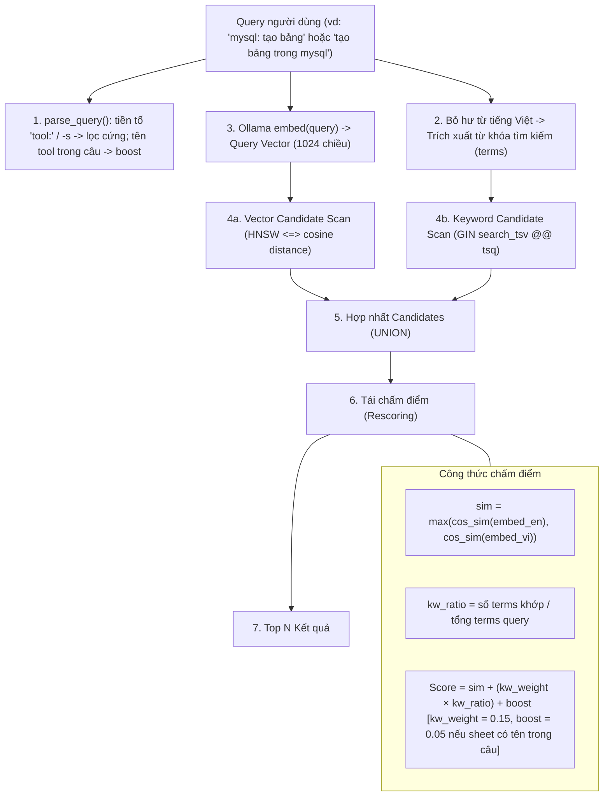

# Feature 01: Hybrid Search Engine

> **Mục đích:** Cung cấp cơ chế tìm kiếm lai giữa Semantic Vector Search (`pgvector` + `bge-m3`) và Keyword Full-Text Search (`tsvector` + `unaccent`), hỗ trợ tự nhiên cả tiếng Anh lẫn tiếng Việt không dấu/có dấu.

---

## 📂 Các File Liên Quan

| File | Vai trò trong Feature |
|---|---|
| [`cheatsheet/search.py`](file:///home/chuminh/cheatsheet/cheatsheet/search.py) | Module Python thực hiện embed câu hỏi và gọi stored procedure `search_entries()`. Kèm CLI kiểm tra nhanh điểm số. |
| [`cheatsheet/embedder.py`](file:///home/chuminh/cheatsheet/cheatsheet/embedder.py) | Hàm [`embed()`](file:///home/chuminh/cheatsheet/cheatsheet/embedder.py#L17) và [`to_pgvector()`](file:///home/chuminh/cheatsheet/cheatsheet/embedder.py#L51) chuyển text câu hỏi thành vector biểu diễn trong SQL. |
| [`db/schema.sql`](file:///home/chuminh/cheatsheet/db/schema.sql#L146-L216) | Chứa stored procedure [`search_entries()`](file:///home/chuminh/cheatsheet/db/schema.sql#L146), chỉ mục HNSW cosine `embeddings_hnsw`, GIN `search_tsv`, hàm [`f_unaccent()`](file:///home/chuminh/cheatsheet/db/schema.sql#L22). |
| [`cheatsheet/config.py`](file:///home/chuminh/cheatsheet/cheatsheet/config.py) | Cung cấp thông số cấu hình model embedding (`EMBED_MODEL = "bge-m3"`) và kết nối cơ sở dữ liệu `DATABASE_URL`. |

---

## ⚙️ Luồng Hoạt Động & Cơ Chế Cốt Lõi



### 1. Phạm vi sheet: lọc cứng vs ưu tiên (`parse_query()` trong `search.py`)
- Dựa trên cột `sheets.aliases` (ví dụ: `neovim` có alias `nvim`, `vim`; `psql` có `pg`, `postgres`, `postgresql`). Xem đủ bằng `chs --list`.
- **Lọc cứng** (`p_sheet`) chỉ khi người dùng chỉ rõ: tiền tố *"nvim: chia đôi màn hình"* hoặc `-s nvim`. Tiền tố được bỏ khỏi văn bản embed.
- **Ưu tiên** (`p_boost`, +0.05 điểm) khi tên tool chỉ nằm trong câu: *"chia đôi màn hình trong nvim"*. Không lọc cứng vì tên tool có thể là đối tượng chứ không phải tool cần tìm — *"import history from bash"* cần `atuin import bash`, *"find and replace in vim"* cần `:%s` của neovim (trước đây alias dài nhất `find` thắng và khoá nhầm sheet). Tên tool vẫn giữ trong keyword vì nó giúp khớp đúng những lệnh như `atuin import bash`.
- Trọng số 0.05 chọn bằng đo đạc: tăng tỷ lệ top-5 cùng sheet được nêu từ 56/70 → 64/70 trên 14 câu thử, không đổi hit@1; 0.1 bắt đầu kéo entry sheet bash lên trên atuin.

### 2. Xử lý tiếng Việt & Bỏ hư từ (Stopwords Filtering)
- Tự động bỏ dấu qua [`f_unaccent()`](file:///home/chuminh/cheatsheet/db/schema.sql#L22) để người dùng gõ `xoa dong` vẫn khớp với `xoá dòng` / `xóa dòng`.
- Loại bỏ danh sách hư từ phổ biến: `la`, `gi`, `cua`, `cac`, `nhung`, `cho`, `trong`, `mot`, `va`, `voi`, `de`, `thi`, `nao`, `cach`, `the`, `nay`, `do`, `duoc`, `co`, `cau`, `lenh`, `muon`, `toi`, `minh`, `hay`.

### 3. Tìm kiếm 2 tầng & Hai vector đối sánh
- **Hai vector trên mỗi entry:**
  - `embed_text`: Ngữ cảnh + Lệnh + Mô tả tiếng Anh gốc.
  - `embed_text_vi`: Ngữ cảnh + Lệnh + Mô tả tiếng Việt + 3 cụm từ tìm kiếm tiếng Việt tương đương.
- `sim` được lấy bằng `max()` tương đồng cosine giữa câu hỏi với cả 2 vector, giúp câu hỏi dù gõ tiếng Anh hay tiếng Việt tự nhiên đều bắt trúng đích.

---

## 🛠️ Hướng Dẫn Sử Dụng & Kiểm Thử

### 1. Gọi trực tiếp bằng Python
```python
import psycopg
from cheatsheet.search import parse_query, search
from cheatsheet.config import DATABASE_URL

with psycopg.connect(DATABASE_URL) as conn:
    results = search(conn, parse_query(conn, "mysql: tạo bảng"), limit=5, kw_weight=0.15)
    for r in results:
        print(f"[{r['score']:.3f}] {r['command']} - {r['description_vi'] or r['description']}")
```

### 2. Chạy debug trực tiếp qua CLI
```bash
# Tìm kiếm tổng quát
uv run -m cheatsheet.search "chia đôi màn hình dọc"

# Tìm kiếm giới hạn trong sheet và số lượng kết quả
uv run -m cheatsheet.search -s neovim -n 3 "ghi file và thoát"
```
Output sẽ hiển thị chi tiết điểm `score`, độ tương đồng vector `sim`, và tỷ lệ khớp keyword `kw`.
