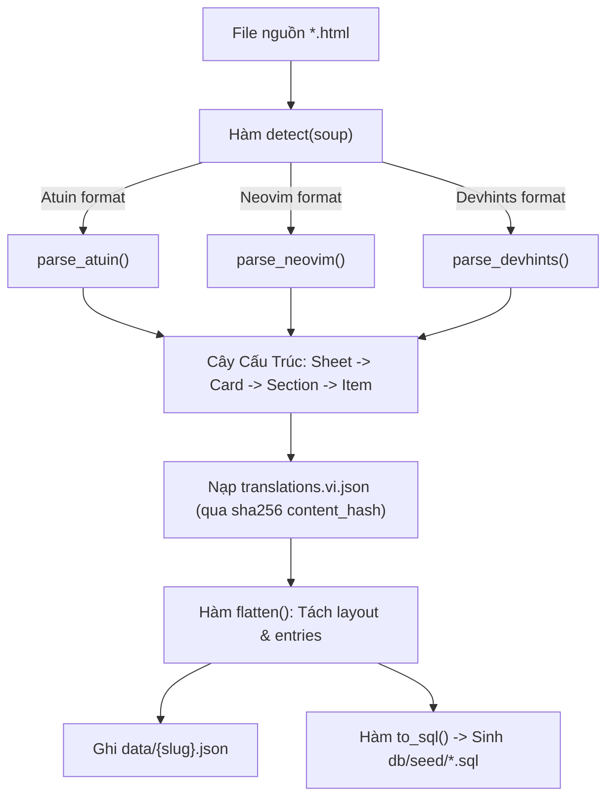

# Feature 02: Data Ingestion & HTML Extraction

> **Mục đích:** Parser trích xuất nội dung từ các file HTML cheatsheet nguồn, tự động nhận diện cấu trúc giao diện, chuẩn hóa dữ liệu thành cây `card → section → item`, trải phẳng thành `entries` (đơn vị tìm kiếm) và sinh file `db/seed/<slug>.sql` (1 file / sheet) cùng các file `data/*.json`.

---

## 📂 Các File Liên Quan

| File | Vai trò trong Feature |
|---|---|
| [`cheatsheet/extract.py`](file:///home/chuminh/cheatsheet/cheatsheet/extract.py) | Module chính chứa toàn bộ parser HTML, logic bóc tách code block, trải phẳng dữ liệu và xuất SQL. |
| [`data/*.json`](file:///home/chuminh/cheatsheet/data/) | File JSON trung gian lưu toàn bộ cấu trúc cards, entries của từng sheet (dùng để soát lỗi và cấp dữ liệu cho module dịch). |
| [`db/seed/<slug>.sql`](file:///home/chuminh/cheatsheet/db/seed/) | Mỗi sheet một file SQL tự sinh, tự chứa: `DELETE` sheet cũ theo slug rồi `INSERT INTO sheets` + `INSERT INTO entries` (sheet_id tra theo slug, không cố định id) — nạp riêng một file cũng được. |
| [`data/translations.vi.json`](file:///home/chuminh/cheatsheet/data/translations.vi.json) | Bản dịch tiếng Việt được nạp để ghép nối vào từng entry qua `content_hash`. |
| [`cheatsheet/config.py`](file:///home/chuminh/cheatsheet/cheatsheet/config.py) | Khai báo đường dẫn thư mục gốc `ROOT`. |

---

## ⚙️ Luồng Hoạt Động & Cơ Chế Cốt Lõi



### 1. Nhận diện cấu trúc tự động (`detect`)
Parser hỗ trợ các khuôn mẫu HTML phổ biến:
- **Atuin-style**: Cấu trúc thẻ `<main .card>` gồm header `h2` và body có table/pre/row.
- **Neovim-style**: Cấu trúc `#grid > .card` kèm các thuộc tính tooltip mở rộng (`data-tip`, `data-example`, `data-danger`).
- **Devhints-style**: Cấu trúc `section.h3-section` với heading `h4`, `pre.language-*` và paragraph.

### 2. Bóc tách code block (`split_code`)
- Code block nhiều dòng được phân rã thành từng câu lệnh độc lập.
- Các comment đứng trước (`#` hoặc `--`) hoặc comment cùng dòng được tự động nhận dạng làm mô tả (`description`).
- Tự động lọc bỏ shell prompt (`$ `) hoặc database prompt (`mysql> `).

### 3. Trải phẳng dữ liệu & Ghép bản dịch (`flatten`)
- **`layout` (JSONB)**: Lưu cấu trúc card, section, cột hiển thị để frontend render Web UI nguyên bản.
- **`entries`**: Từng dòng lệnh/phím tắt/tùy chọn với:
  - `embed_text`: Ghép từ `tool › card › section + command + description + details`.
  - `content_hash`: Mã băm `sha256(embed_text)` dùng làm khóa liên kết duy nhất sang bảng vector `embeddings` và file dịch.
  - `description_vi` & `embed_text_vi`: Ghép từ `translations.vi.json` nếu đã có.

---

## 🛠️ Hướng Dẫn Thực Thi

### 1. Trích xuất toàn bộ file HTML hiện có
```bash
uv run -m cheatsheet.extract
```

### 2. Quy trình thêm một Cheatsheet mới
1. Đặt file HTML vào thư mục gốc của repo (ví dụ: `git.html`, `docker.html`).
2. *(Nếu là giao diện mới)* Bổ sung hàm parser trong [`cheatsheet/extract.py`](file:///home/chuminh/cheatsheet/cheatsheet/extract.py) và đăng ký vào [`detect()`](file:///home/chuminh/cheatsheet/cheatsheet/extract.py#L366).
3. Chạy lệnh trích xuất: `uv run -m cheatsheet.extract`.
4. Sinh bản dịch tiếng Việt: `uv run -m cheatsheet.translate`.
5. Nạp vào database:
   ```bash
   docker compose exec -T db sh -c 'psql -v ON_ERROR_STOP=1 -U "$POSTGRES_USER" -d "$POSTGRES_DB"' < db/seed/<slug>.sql  # hoặc make load
   uv run -m cheatsheet.embed --prune
   ```
