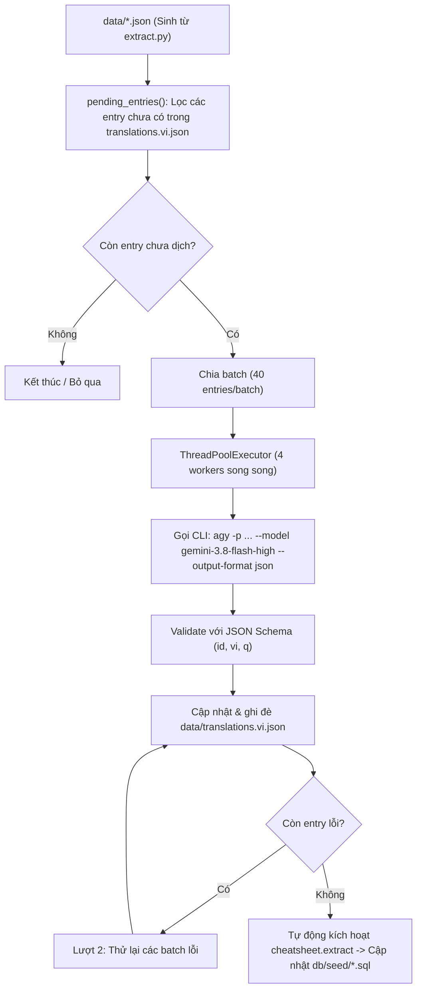

# Feature 03: Bilingual Translation & Query Augmentation

> **Mục đích:** Tự động sinh bản dịch tiếng Việt súc tích và 3 cụm từ tìm kiếm đồng nghĩa tự nhiên cho từng entry thông qua LLM (Antigravity CLI `agy` với model `gemini-3.8-flash-high`). Kết quả được lưu cache vào `data/translations.vi.json` theo `content_hash` để đảm bảo chạy lại an toàn và incremental.

---

## 📂 Các File Liên Quan

| File | Vai trò trong Feature |
|---|---|
| [`cheatsheet/translate.py`](file:///home/chuminh/cheatsheet/cheatsheet/translate.py) | Module điều phối quá trình dịch: lọc entry thiếu, chia batch, gọi `agy` song song, lưu cache và kích hoạt lại extract. |
| [`data/translations.vi.json`](file:///home/chuminh/cheatsheet/data/translations.vi.json) | File cache lưu trữ toàn bộ bản dịch tiếng Việt và các cụm từ truy vấn tương ứng theo `content_hash`. |
| [`cheatsheet/extract.py`](file:///home/chuminh/cheatsheet/cheatsheet/extract.py#L30-L33) | Nạp cache bản dịch từ file JSON để ghép nối vào dữ liệu đầu vào của database (`embed_text_vi`). |
| [`cheatsheet/config.py`](file:///home/chuminh/cheatsheet/cheatsheet/config.py) | Đường dẫn thư mục gốc `ROOT`. |

---

## ⚙️ Luồng Hoạt Động & Cơ Chế Cốt Lõi



### 1. Yêu cầu đầu ra chuẩn hóa (Structured JSON Schema)
Với mỗi entry, mô hình AI phải trả về định dạng JSON nghiêm ngặt:
- `id`: Định danh theo số thứ tự của entry trong batch.
- `vi`: Mô tả tiếng Việt ngắn gọn (tối đa ~15 từ), dịch theo đúng ngữ cảnh kỹ thuật, giữ nguyên thuật ngữ quen thuộc (*database, buffer, commit, regex...*).
- `q`: Đúng 3 cụm từ tìm kiếm tiếng Việt KHÁC NHAU mà người dùng thực tế sẽ gõ (dùng từ đồng nghĩa như *xóa/gỡ bỏ*, *copy/sao chép*...; không chứa từ đệm vô nghĩa hay tên tool).

### 2. Bộ đệm bất biến (Idempotent & Incremental Caching)
- Mỗi bản ghi dịch được định danh bằng mã băm `sha256(embed_text)`.
- Khi cheatsheet cập nhật nội dung tiếng Anh, chỉ các entry có `content_hash` thay đổi mới được dịch lại.
- Cho phép người dùng chỉnh sửa tay file [`data/translations.vi.json`](file:///home/chuminh/cheatsheet/data/translations.vi.json) mà không sợ bị ghi đè mất ở các lần chạy sau.

---

## 🛠️ Hướng Dẫn Sử Dụng

### 1. Kiểm tra số lượng entry cần dịch (Dry Run)
```bash
uv run -m cheatsheet.translate --dry-run
```

### 2. Thực hiện dịch tự động
```bash
uv run -m cheatsheet.translate
```
*(Yêu cầu máy đã cài đặt CLI `agy`. Nếu không có `agy`, hệ thống sẽ cảnh báo và bỏ qua bước này, hệ thống vẫn hoạt động bình thường với bản dịch sẵn có).*
