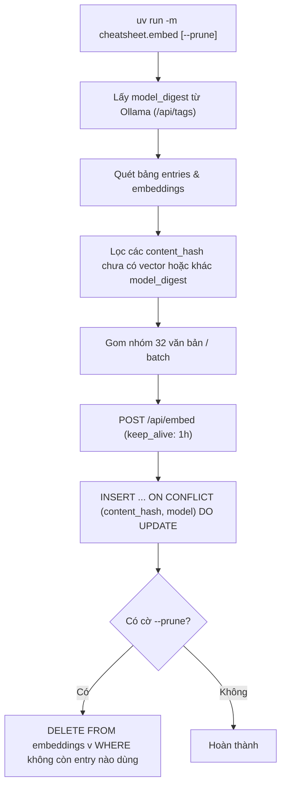

# Feature 04: Vector Embedding Pipeline

> **Mục đích:** Tính toán và lưu trữ các vector embedding 1024 chiều vào bảng `embeddings` của PostgreSQL qua pgvector. Tận dụng mô hình `bge-m3` chạy native trên Ollama, cơ chế xử lý gia tăng (incremental) và kiểm tra `model_digest` tự động để không bao giờ trộn vector giữa các bản cập nhật model.

---

## 📂 Các File Liên Quan

| File | Vai trò trong Feature |
|---|---|
| [`cheatsheet/embed.py`](file:///home/chuminh/cheatsheet/cheatsheet/embed.py) | Script thực thi embedding hàng loạt: quét entry thiếu vector, gom batch, ghi DB và dọn rác vector mồ côi. |
| [`cheatsheet/embedder.py`](file:///home/chuminh/cheatsheet/cheatsheet/embedder.py) | Client HTTP kết nối native Ollama API (`/api/embed` và `/api/tags`), hàm định dạng `to_pgvector()`. |
| [`cheatsheet/config.py`](file:///home/chuminh/cheatsheet/cheatsheet/config.py) | Chứa các tham số: `OLLAMA_URL`, `EMBED_MODEL = "bge-m3"`, `EMBED_DIM = 1024`, `OLLAMA_KEEP_ALIVE = "1h"`. |
| [`db/schema.sql`](file:///home/chuminh/cheatsheet/db/schema.sql#L77-L86) | Bảng `embeddings (content_hash, model, model_digest, embedding)` và chỉ mục HNSW `vector_cosine_ops`. |

---

## ⚙️ Luồng Hoạt Động & Cơ Chế Cốt Lõi



### 1. Đồng bộ Model Digest (Model Version Tracking)
- Khi mô hình được cập nhật qua `ollama pull bge-m3`, digest của mô hình sẽ thay đổi mặc dù tên model giữ nguyên.
- Hệ thống tự động so khớp `model_digest`. Khi phát hiện digest mới, toàn bộ dữ liệu sẽ tự động được re-embed theo weights mới, loại bỏ nguy cơ so sánh khoảng cách giữa vector của hai phiên bản model khác nhau.

### 2. Hai vector cho mỗi bản ghi (Dual Embeddings)
Hệ thống embed độc lập 2 nguồn văn bản cho mỗi dòng:
1. `embed_text`: Ngữ cảnh tool/card/section + câu lệnh + mô tả gốc (tiếng Anh).
2. `embed_text_vi`: Ngữ cảnh + câu lệnh + mô tả Việt + 3 truy vấn mẫu (tiếng Việt).

### 3. Tối ưu hóa hiệu năng
- **Ollama Keep-Alive (`1h`)**: Giữ mô hình trong VRAM/RAM giữa các lần gọi để không mất thời gian tải lại weights.
- **Batch Processing (`BATCH = 32`)**: Tận dụng tính toán song song trên GPU/NPU của máy local.
- **Chuẩn hóa vector**: Vector sinh bởi Ollama đã được chuẩn hóa L2, cho phép dùng khoảng cách Cosine hiệu quả cao trên HNSW index.

---

## 🛠️ Hướng Dẫn Thực Thi

### 1. Chỉ embed các entry mới hoặc sửa đổi
```bash
uv run -m cheatsheet.embed
```

### 2. Embed và dọn sạch vector mồ côi (khuyên dùng khi cập nhật seed)
```bash
uv run -m cheatsheet.embed --prune
```
