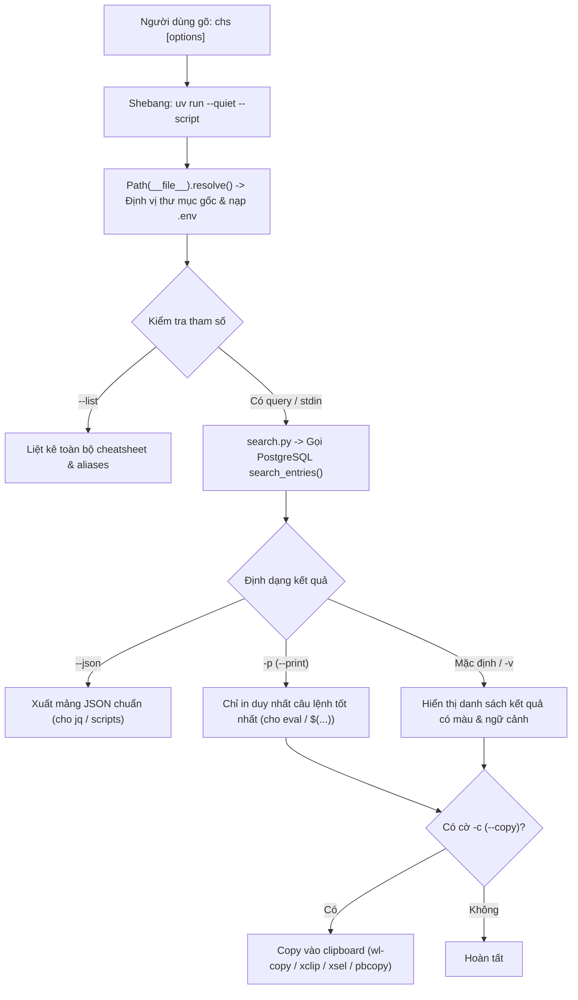

# Feature 05: Terminal CLI (`chs`)

> **Mục đích:** Cung cấp công cụ dòng lệnh `chs` tra cứu cheatsheet trực tiếp từ Terminal bằng ngôn ngữ tự nhiên. Chạy tức thì qua PEP 723 shebang (`uv run --script`), hỗ trợ copy tự động vào clipboard (`-c`), in lệnh cho shell expansion/eval (`-p`), và định dạng màu ANSI đẹp mắt.

---

## 📂 Các File Liên Quan

| File | Vai trò trong Feature |
|---|---|
| [`chs`](file:///home/chuminh/cheatsheet/chs) | Symlink tại thư mục gốc trỏ tới `cheatsheet/cli.py` (dùng để symlink tiếp ra `~/.local/bin/chs`). |
| [`cheatsheet/cli.py`](file:///home/chuminh/cheatsheet/cheatsheet/cli.py) | Toàn bộ mã nguồn CLI: parse cờ lệnh, xử lý màu sắc ANSI, clipboard copier, format hiển thị và xử lý lỗi. |
| [`cheatsheet/search.py`](file:///home/chuminh/cheatsheet/cheatsheet/search.py) | Module backend thực hiện kết nối database và tra cứu hybrid search. |
| [`cheatsheet/config.py`](file:///home/chuminh/cheatsheet/cheatsheet/config.py) | Nạp cấu hình tự động từ `.env` tại thư mục gốc dù CLI được gọi từ bất kỳ thư mục nào trong terminal. |

---

## ⚙️ Luồng Hoạt Động & Cơ Chế Cốt Lõi



### 1. Thực thi không cần môi trường ảo thủ công
- Đầu file `cli.py` sử dụng chuẩn PEP 723 inline script metadata:
  ```python
  #!/usr/bin/env -S uv run --quiet --script
  # /// script
  # requires-python = ">=3.11"
  # dependencies = ["psycopg[binary]>=3.2"]
  # ///
  ```
- `uv` tự động nạp dependencies vào cache hệ thống, không yêu cầu người dùng phải `source .venv/bin/activate`.

### 2. Tự động tìm thư mục gốc qua Symlink
- Nhờ `Path(__file__).resolve().parents[1]`, dù người dùng gọi lệnh `chs` từ bất kỳ thư mục làm việc nào, CLI vẫn tự động xác định được vị trí file `.env` và thư mục project để kết nối cơ sở dữ liệu.

---

## 🛠️ Hướng Dẫn Sử Dụng & Bảng Cờ Lệnh

### Cài đặt toàn cục (Global Symlink)
```bash
ln -sf "$(pwd)/chs" ~/.local/bin/chs
```

### Các cờ lệnh chính

| Cờ lệnh | Viết tắt | Ý nghĩa & Ví dụ |
|---|---|---|
| `<query>` | | Câu hỏi bằng tiếng Anh hoặc tiếng Việt: `chs "tạo database"` |
| `tool:` | | Tiền tố trong câu hỏi, tương đương `-s`: `chs "mysql: tạo bảng"` (xem mục bên dưới) |
| `--sheet` | `-s` | Chỉ định tìm trong 1 sheet (slug hoặc alias): `chs -s nvim "chia đôi cửa sổ"` |
| `--limit` | `-n` | Số lượng kết quả hiển thị (mặc định là 5): `chs -n 3 "git rebase"` |
| `--copy` | `-c` | Tự động copy lệnh phù hợp nhất vào clipboard: `chs -c "backup database"` |
| `--print` | `-p` | Chỉ in lệnh tốt nhất (không in màu/mô tả): `eval "$(chs -p 'tìm file log')"` |
| `--verbose`| `-v` | In thêm giải thích dài (`details`), ví dụ (`example`) và điểm số (`score`). |
| `--json` | | Xuất kết quả dạng JSON để pipe sang công cụ khác: `chs --json "regex" \| jq` |
| `--list` | | Liệt kê toàn bộ các cheatsheet và số lượng lệnh hiện có. |

### Thu hẹp phạm vi bằng tiền tố `tool:`

Khi có nhiều sheet cùng lĩnh vực (mysql, psql, sqlite...), câu hỏi chung chung như "tạo bảng" dễ trả về lẫn lộn. Ghi tên tool ở đầu câu để chỉ tìm trong sheet đó:

```bash
chs "mysql: tạo bảng"      # = chs -s mysql "tạo bảng"
chs "nvim: xoá dòng"       # nhận cả viết tắt/alias
chs "psql: cấp quyền"      # psql: pg: postgres: postgresql: đều trỏ về sheet psql
chs --list                 # bảng mọi sheet + tiền tố dùng được (--list --json cho script)
```

Tiền tố = slug + tên tool (từ title) + `aliases` khai báo trong `sheets/<slug>.json`. `extract` dừng với lỗi nếu hai sheet trùng alias, nên mỗi tiền tố luôn trỏ về đúng một sheet. Thêm viết tắt mới: bổ sung vào `aliases` của file JSON rồi chạy lại extract + seed.

- `parse_query()` trong `cheatsheet/search.py` tách tiền tố (tên tool ASCII + `:`), đổi alias → slug và **bỏ tiền tố khỏi văn bản embed** (giữ `mysql:` trong vector làm hit@1 giảm ~5 điểm). Web UI / `/api/search` dùng chung cơ chế này.
- Tiền tố không khớp sheet nào (vd `git:` khi chưa có sheet git, hay `error: ...`) → cảnh báo trên stderr và tìm như bình thường với nguyên câu hỏi. `-s` sai tên → báo lỗi, thoát mã 2.
- Không bắt buộc cú pháp này: tên tool ở bất kỳ đâu trong câu vẫn được ưu tiên (cộng điểm, không lọc cứng — xem [01-hybrid-search.md](01-hybrid-search.md)). Khi không chỉ rõ tool mà kết quả lẫn nhiều sheet, `chs` in gợi ý (stderr, không in với `-p`/`--json`), vd: `gợi ý: ... vd: chs "neovim: xoá"`.
