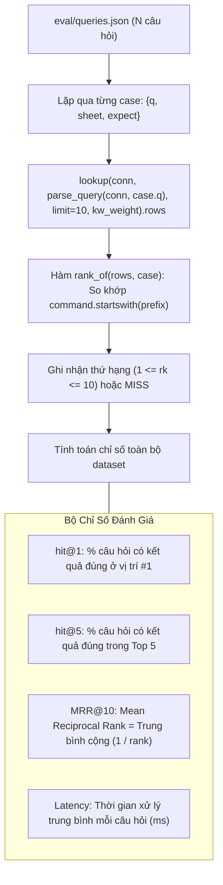

# Feature 07: Search Quality Evaluation & Benchmark

> **Mục đích:** Cung cấp công cụ đo lường và đánh giá định lượng chất lượng của thuật toán Hybrid Search dựa trên tập câu hỏi chuẩn tại `eval/queries.json`. Tính toán các chỉ số chuẩn trong Information Retrieval như **hit@1**, **hit@5**, **MRR@10** và thời gian phản hồi trung bình.

---

## 📂 Các File Liên Quan

| File | Vai trò trong Feature |
|---|---|
| [`cheatsheet/evaluate.py`](file:///home/chuminh/cheatsheet/cheatsheet/evaluate.py) | Script thực thi benchmark: nạp tập mẫu, lặp qua từng câu hỏi, kiểm tra tiền tố kỳ vọng và tính toán chỉ số thống kê. |
| [`eval/queries.json`](file:///home/chuminh/cheatsheet/eval/queries.json) | Bộ câu hỏi kiểm thử chuẩn gồm câu hỏi thực tế (tiếng Việt/tiếng Anh) và danh sách lệnh kỳ vọng (`expect`). |
| [`cheatsheet/search.py`](file:///home/chuminh/cheatsheet/cheatsheet/search.py) | Module search được đem ra đánh giá hiệu năng và độ chính xác. |
| [`cheatsheet/config.py`](file:///home/chuminh/cheatsheet/cheatsheet/config.py) | Nạp thông tin kết nối database. |

---

## ⚙️ Luồng Hoạt Động & Cơ Chế Cốt Lõi



### 1. Cơ chế đối soát kết quả (Prefix Matching)
- Trong tập mẫu `eval/queries.json`, mỗi testcase định nghĩa:
  ```json
  {
    "q": "câu lệnh tạo bảng trong mysql là gì?",
    "sheet": "mysql",
    "expect": ["CREATE TABLE"]
  }
  ```
- Kết quả được coi là đúng ở vị trí `i` nếu câu lệnh trả về bắt đầu bằng một trong các tiền tố trong danh sách `expect` (và thuộc đúng `sheet` nếu có chỉ định).
- **Câu có nêu tool** (`"rename column mysql"`, `"psql: cấp quyền"`) → ghi `sheet`: đáp án phải thuộc đúng sheet đó.
- **Câu không nêu tool** (`"xem danh sách các bảng"`) → không ghi `sheet`, và `expect` liệt kê đáp án đúng của **mọi** sheet (`SHOW TABLES;` của mysql lẫn `\dt` của psql). Khi thêm sheet mới cùng lĩnh vực, cần bổ sung đáp án của sheet đó vào các câu chung, nếu không hit@1 tụt giả tạo.
- Đáp án chỉ đúng ở một sheet cụ thể (vì cùng tiền tố nhưng nghĩa khác ở sheet khác) dùng dạng object:
  ```json
  {"q": "hiện số dòng", "expect": [":set number", {"sheet": "grep", "cmd": "-n"}, {"sheet": "sed", "cmd": "="}]}
  ```
  (`-n` của grep là "hiện số dòng", còn `-n` của sed là "không in tự động").
- Bộ mẫu hiện có 133 câu phủ 13 sheet, gồm cả câu dạng tiền tố `tool:` và câu có tên tool đóng vai đối tượng (`"import history from bash"` → atuin, `"find and replace in vim"` → neovim).
- Script đánh giá đi qua `lookup()` như CLI/API, nên `SEARCH_MIN_SIMILARITY` trong `.env` cũng ảnh hưởng các chỉ số nếu đặt quá cao.

### 2. Tinh chỉnh trọng số Keyword (`--kw-weight`)
- Tham số `-w` cho phép lập trình viên chạy thử nghiệm các trọng số kết hợp giữa Vector và Keyword (`0.0`, `0.1`, `0.15`, `0.2`...) để tìm ra điểm cân bằng tối ưu nhất cho tập dữ liệu.

---

## 🛠️ Hướng Dẫn Thực Thi

### 1. Chạy đánh giá cơ bản
```bash
uv run -m cheatsheet.evaluate
```
*Kết quả in ra tổng kết và danh sách các câu hỏi bị trượt (miss) hoặc có rank > 1 để người phát triển tinh chỉnh lại từ điển dịch hoặc trọng số.*

### 2. In chi tiết thứ hạng từng câu hỏi
```bash
uv run -m cheatsheet.evaluate -v
```

### 3. Thử nghiệm với trọng số Keyword tùy biến
```bash
uv run -m cheatsheet.evaluate -w 0.20
```
