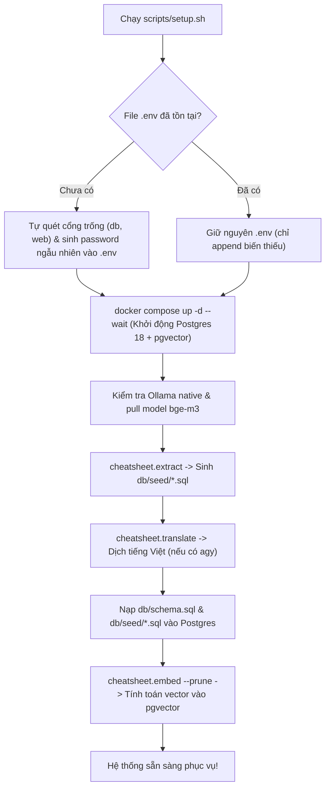

# Feature 08: Database Schema & Infrastructure

> **Mục đích:** Quản lý hạ tầng cơ sở dữ liệu PostgreSQL 18 mở rộng tiện ích `pgvector` thông qua Docker Compose, cấu trúc bảng dữ liệu tối ưu cho tìm kiếm ngữ nghĩa, và script tự động hóa triển khai toàn bộ hệ thống bằng một dòng lệnh (`scripts/setup.sh`).

---

## 📂 Các File Liên Quan

| File | Vai trò trong Feature |
|---|---|
| [`db/schema.sql`](file:///home/chuminh/cheatsheet/db/schema.sql) | DDL khởi tạo toàn bộ schema: bảng `sheets`, `entries`, `embeddings`, chỉ mục HNSW/GIN, view `sheet_list` và hàm `search_entries()`, `sheet_json()`. |
| [`db/seed/<slug>.sql`](file:///home/chuminh/cheatsheet/db/seed/) | Dữ liệu khởi tạo sinh tự động từ `sheets/*.json` / HTML, 1 file / sheet. |
| [`docker-compose.yml`](file:///home/chuminh/cheatsheet/docker-compose.yml) | Cấu hình dịch vụ PostgreSQL 18 kèm pgvector, quản lý volume dữ liệu `pgdata`. |
| [`scripts/setup.sh`](file:///home/chuminh/cheatsheet/scripts/setup.sh) | Script bash tự động hóa: quét cổng trống, tạo `.env`, khởi chạy container, kiểm tra Ollama, migrate schema, seed và embed. |
| [`.env.example`](file:///home/chuminh/cheatsheet/.env.example) / `.env` | File khai báo biến môi trường kết nối database, cổng web và URL Ollama. |

---

## ⚙️ Luồng Hoạt Động & Cơ Chế Cốt Lõi



### 1. Kiến trúc Bảng Dữ Liệu Tối Ưu (Schema Design)

```
sheets (1 dòng / cheatsheet)
 ├── id, slug, title, aliases (text[])
 └── layout (jsonb) ──> Cấu trúc cây thẻ phục vụ render web

entries (1 dòng / lệnh, shortcut, option - ĐƠN VỊ TÌM KIẾM)
 ├── sheet_id ──> Khóa ngoại liên kết sheets
 ├── command, description, details, danger, example
 ├── embed_text       ──> Văn bản tiếng Anh gốc
 ├── content_hash     ──> sha256(embed_text)
 ├── description_vi   ──> Mô tả tiếng Việt
 ├── embed_text_vi    ──> Văn bản mở rộng tiếng Việt
 ├── content_hash_vi  ──> sha256(embed_text_vi)
 └── search_tsv       ──> tsvector GENERATED ALWAYS (GIN index)

embeddings (Bộ nhớ đệm vector - Độc lập với entries)
 ├── content_hash     ──> Khóa liên kết với entries (content_hash hoặc content_hash_vi)
 ├── model, model_digest
 └── embedding        ──> vector(1024) có chỉ mục HNSW (cosine)
```

- **Tách biệt `entries` và `embeddings`**: Khi chạy lại `db/seed/*.sql`, bảng `entries` được nạp lại nhưng bảng `embeddings` được bảo toàn. Các dòng dữ liệu không thay đổi nội dung sẽ tự động khớp lại vector cũ qua `content_hash` mà không phải tốn tài nguyên embed lại.

---

## 🛠️ Hướng Dẫn Vận Hành Hạ Tầng

### 1. Khởi tạo toàn bộ chỉ với 1 bước
```bash
chmod +x scripts/setup.sh
./scripts/setup.sh
```

### 2. Quản lý Docker Container
```bash
# Bật database ngầm
docker compose up -d

# Xem log database
docker compose logs -f db

# Tắt database (vẫn giữ dữ liệu trong volume)
docker compose down

# Truy cập trực tiếp psql trong container
docker compose exec -it db sh -c 'psql -U "$POSTGRES_USER" -d "$POSTGRES_DB"'
```
